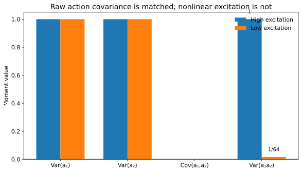
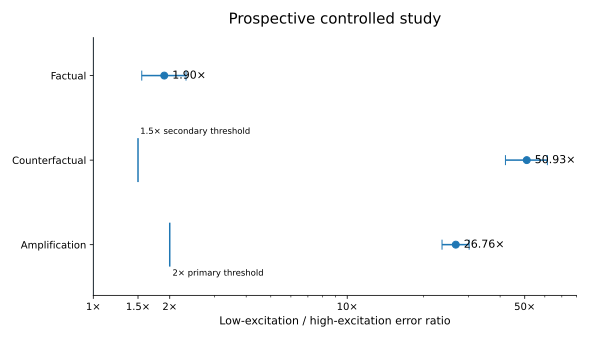
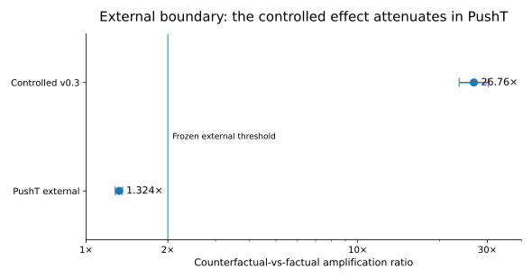

# Matched Action Covariance Can Hide Counterfactual Weakness

A small study of when action-conditioned dynamics models look well-covered under ordinary action statistics but remain weak under alternative interventions.

The central construction is simple: two behavior policies have the same action mean and covariance, but they excite the nonlinear feature `a1*a2` very differently.



## Main result

I first preregistered a stronger claim: that the low-excitation model would retain near-equivalent factual accuracy while becoming much worse counterfactually. That claim failed.

I then froze a narrower prospective hypothesis on fresh seeds and held-out interaction strengths: **counterfactual degradation should exceed factual degradation by more than 2×**.

Across 20 paired runs:

| Quantity | Low / high excitation | 95% CI |
|---|---:|---:|
| Factual error | 1.90× | [1.55, 2.32] |
| Counterfactual error | 50.93× | [41.98, 61.42] |
| Counterfactual-vs-factual amplification | **26.76×** | **[23.62, 30.21]** |

All 20 paired runs exceeded the frozen 2× amplification threshold.



## External boundary: PushT

I then froze an external test in PushT using matched anchor states and the same model class.

The effect was much smaller:

| Quantity | Low / high excitation |
|---|---:|
| Factual error | 1.001× |
| Counterfactual error | 1.325× |
| Amplification | 1.324× |

PushT **failed both preregistered magnitude thresholds** (2× amplification and 1.5× raw counterfactual degradation). I treat this as a boundary on the controlled result, not as external confirmation.



## What the study supports

In the tested controlled nonlinear dynamics, matching raw action mean and covariance did not guarantee comparable excitation of a transition-relevant nonlinear action feature. Weak excitation produced a substantially larger degradation under alternative interventions than under behavior-weighted factual evaluation.

It does **not** establish a universal failure of world models, a new theory of persistent excitation, or broad external validity.

## What failed

- **v0.2.1:** the preregistered factual-equivalence criterion failed; factual error degraded by about 1.94×.
- **PushT:** the external 2× amplification threshold and 1.5× counterfactual threshold both failed.
- **Post-hoc mechanism audit:** a proposed explanation based on contact/block-motion states was falsified; the relative gap was actually smaller in those states.

These failures are retained in the repository.

## Repository map

- `src/` — dynamics, data, models, metrics, and PushT utilities
- `experiments/` — controlled, confirmatory, external, and diagnostic runners
- `configs/` — frozen protocols, claim boundaries, and hash manifests
- `results/derived/` — aggregate analyses used in the figures
- `results/raw/` — compact raw run summaries for the main studies
- `results/deviations/` — runtime fixes and protocol notes
- `tests/` — construction and external-protocol checks

## Reproduce

From the repository root, install the core dependencies once:

```bash
python -m pip install -e .
```

Controlled study:

```bash
python -m pytest -q
python experiments/e1_diagnostic.py
python experiments/run_v03_confirmatory.py
python experiments/analyze_v03.py
```

PushT:

```bash
python -m pip install -r requirements-pusht-runtime.txt
PYTHONPATH=. python experiments/run_pusht_external.py
PYTHONPATH=. python experiments/analyze_pusht_external.py
```

## Research status

Solo research project by **Saurav Sharma**.

A revised technical preprint is in preparation. The previous draft is intentionally not included here while the manuscript is being rewritten.

## Citation

Citation metadata is provided in [CITATION.cff](CITATION.cff).

## License

Code is released under the MIT License.
